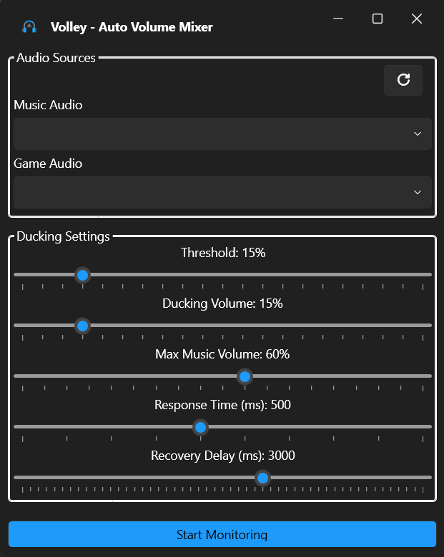

# Volley - Auto Volume Mixer

*Dynamically adjusts music volume when game sounds get louder*

## 🎯 Features
- **Automatic volume balancing** between music and games  
- **Customizable thresholds**: Set sensitivity for ducking  
- **Customizable Ducking Volume**: Set volume of music after ducking  
- **Customizable Max Music Volume**: Set maximum volume of the music  
- **Customizable Response Time**: Set how long it takes to lower the music volume  
- **Customizable Recovery Time**: Set how long it takes to restore music volume  

## 📥 Download  
Get the latest release:  
👉 [Download Volley v1.0](https://github.com/ANOOBALSA/Volley/releases/latest)  

**Requirements**:  
- Windows 10/11  
- .NET 8.0 Runtime ([Download here](https://dotnet.microsoft.com/download))  

## 🛠️ How It Works  
1. **Select audio sources** (music app + game)  
2. Set your preferred **ducking volume and settings**  
3. Play! Volley automatically lowers music during loud game moments  

  

